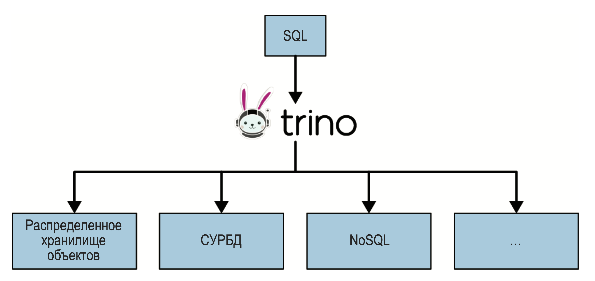
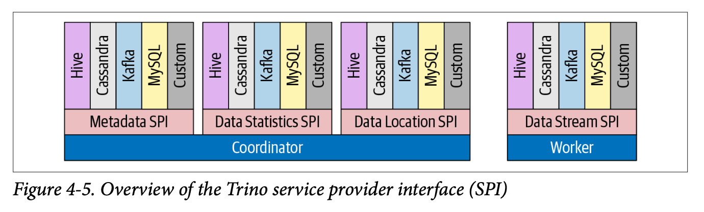

# Что такое Trino

Trino (ранее известный как Presto) - это распределенная SQL-движок, разработанный для выполнения запросов к большим
объемам данных. Он был создан в Facebook и теперь поддерживается сообществом. Trino позволяет выполнять SQL-запросы к
данным, хранящимся в различных источниках, таких как Hadoop, S3, Cassandra, MySQL и многие другие.

## Как работает Trino

Trino использует архитектуру "координатор-воркер". Координатор отвечает за прием запросов, планирование их выполнения и
распределение задач между воркерами. Воркеры выполняют задачи, обрабатывают данные и возвращают результаты координатору,
который затем объединяет их и отправляет обратно клиенту.

## А где данные?

Сам по себе Trino **не хранит данные**. Он работает с данными, которые находятся в различных источниках, таких как базы
данных, файловые системы и облачные хранилища. Trino использует коннекторы для взаимодействия с этими источниками
данных. Коннекторы позволяют Trino выполнять SQL-запросы к данным, независимо от их местоположения и формата. Это делает
Trino мощным инструментом для анализа данных, так как он может обрабатывать данные из различных источников без
необходимости их перемещения или копирования.

### SPI

Каждый коннектор, который используется в Trino реализован по определённому протоколу: Service Provider Interface (SPI).

Каждый коннектор настроен по-своему и он позволяет работать с "*источником*" нативно.

К примеру, чтобы получить список таблиц, где-то используется `information_schema`, а где-то API. И всё это "*скрыто*" в
коннекторе.

Поэтому, если необходимо реализовать коннектор к специфическому источнику, то нужно обратиться в community Trino или
реализовать самостоятельно.

## Почему Trino

Trino предоставляет единый SQL-интерфейс для работы с данными, хранящимися в различных источниках. Это позволяет
аналитикам и разработчикам работать с данными, не беспокоясь о том, где они находятся и в каком формате они хранятся.

Trino также обеспечивает высокую производительность и масштабируемость, что делает его идеальным выбором для обработки
больших объемов данных.

Кроме того, Trino поддерживает широкий спектр SQL-функций и операторов, что позволяет выполнять сложные аналитические
запросы и получать глубокие инсайты из данных.

В целом, Trino является мощным инструментом для анализа данных, который позволяет организациям эффективно использовать
свои данные и принимать обоснованные решения.