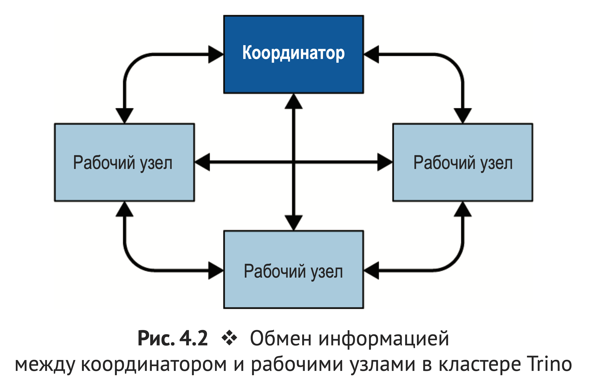

# Что такое Trino Cluster

Trino Cluster — это распределенная система, состоящая из одного координатора и нескольких воркеров.

Координатор отвечает за прием запросов, планирование их выполнения и распределение задач между воркерами.

Воркеры выполняют задачи, обрабатывают данные и возвращают результаты координатору, который затем объединяет их и
отправляет обратно клиенту.

Визуализация архитектуры Trino Cluster:

Визуализация коммуникации между координатором и воркерами:
